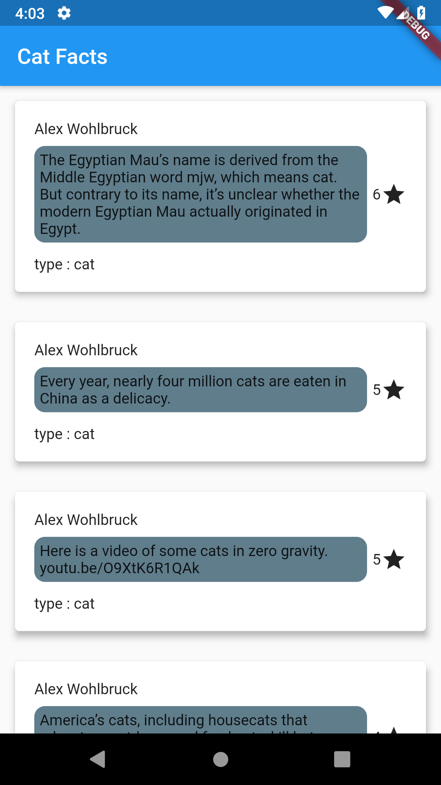

# Cat Facts with Flutter BLoC

This is just a simple app that fetchs the data from cat-facts API.

## API links
[document link](https://alexwohlbruck.github.io/cat-facts/docs/)

[json file link](https://cat-fact.herokuapp.com/facts/)

## Cat Facts UI (world's disgusting ui ever)



## BLoC Pattern

Main point here is not a UI. Main pont is using BLoC pattern as State Management in Flutter.

Import according packages as dependencies (versions can change in the future. Go to check in [pub.dev](https://pub.dev/))

```dart 
dependencies:

  http: ^0.12.0+4
  get_it: ^4.0.1
  equatable: ^1.1.1
  flutter_bloc: ^4.0.0
```

## BLoC Diagram 


